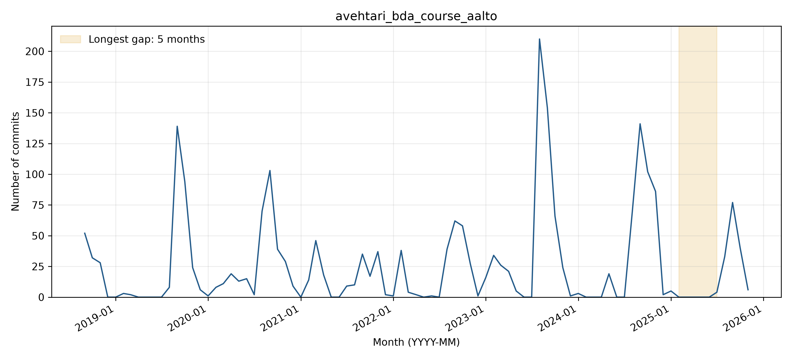

# avehtari_bda_course_aalto: activity and longest-gap reflection

## Observed activity

The complete WoC project manifest contains **2,272 commits** and **67 distinct author strings**, from 2018-09-07 through 2025-11-03. The longest inactivity gap is **2025-02 through 2025-06 (5 months)**. There are **3 gaps of at least three months** and **160 commits after the longest gap**. Counts cover the first through last observed WoC month, without adding trailing inactivity.

**Activity pattern: cyclical.** Repeated late-summer/autumn bursts are consistent with the annual course cycle, although their magnitudes vary substantially. The longest gap is February-June 2025, with three gaps of at least three months overall. Automated site-deployment commits contribute heavily to the counts, so this measures repository activity rather than only human editing effort.

## Interpreting the gap

**Before themes:** Automated bot contributions:Documentation updates. **After themes:** Automated bot contributions:Documentation updates. Each sample uses the final ten commits before or the first ten after the boundary, or all if fewer. Labels follow the full messages, one primary topic per commit; ties are alphabetical. Generic test/configuration/refactoring messages are Other unless the message identifies a more specific topic.

**Hypothesis:** A pause between annual course preparation cycles is plausible: pre-gap human changes concern instructions and project feedback, while later changes prepare the 2025 course and schedule. The commit evidence and repeated seasonal bursts support this interpretation, but there is no explicit statement explaining the exact five-month pause.

**Recovery:** Yes (160 observed commits after the gap). Automated site builds restart in July 2025; August human commits update the course for 2025 and add its schedule (228bbdf2cf; a07e56b38f). The inspected update adds Aalto2025.Rmd and revises assignment dates and environment instructions, supporting preparation for the next course offering.

**Contributors:** Eight of the ten immediate post-gap commits are from the existing Quarto workflow identity and two are by existing contributor Aki Vehtari. The sample does not indicate a new maintainer driving recovery; automated publication resumes before the first sampled human edit. Names/emails are Git author metadata; raw author-string counts are not deduplicated person counts.

The zero-month interval is straightforward to identify from complete data, but the causal interpretation is harder: commit messages show what changed, not necessarily why work stopped. The issue/PR and README.md-history searches in the boundary window returned no items, so neither provides a direct explanation of inactivity. A targeted inspection of the [August 6 course update](https://github.com/avehtari/BDA_course_Aalto/commit/228bbdf2cf32b307f5211634fddb8c698532d2a7) confirms new 2025 course materials and changed assignment dates. The gap is straightforward to locate, but the leading post-gap messages are bot builds, making human motivation harder to infer from the ten-commit sample alone. Counting these builds as commits is required by the dataset definition; it must not be mistaken for an equal count of independent teaching-content changes.

Supporting checks: [issues/PRs created in the boundary window](https://api.github.com/search/issues?q=repo%3Aavehtari%2FBDA_course_Aalto+created%3A2025-01-01..2025-07-31&per_page=30) and [README history or inspected change](https://api.github.com/repos/avehtari/BDA_course_Aalto/commits?path=README.md&since=2025-01-01T00%3A00%3A00Z&until=2025-07-31T23%3A59%3A59Z&per_page=30). The search uses creation dates and does not exhaust later comments on older issues.

## Status at September 30, 2026

The latest GitHub default-branch commit on or before the cutoff is **2026-09-29T11:32:50Z**, so status is **Active** using April 1, 2026 as the Active threshold. See [recent-theme review](bdowlin2_recent_themes.md) for the separately reviewed latest commits. Recovery from an earlier gap does not imply current activity.

## Boundary commit evidence

### Before the gap

- [7c88a18ab0](https://github.com/avehtari/BDA_course_Aalto/commit/7c88a18ab057716bb9bbfb7191f57b74acd6ebaa) (2024-11-28): Built site for gh-pages
- [1c48cfdd5a](https://github.com/avehtari/BDA_course_Aalto/commit/1c48cfdd5a5b212e4de259821d9d51d3b0b52fdb) (2024-11-28): updated instructions and minor fixes
- [1b987c7089](https://github.com/avehtari/BDA_course_Aalto/commit/1b987c7089b5de9ecbad74a97eb8fe054aa3acec) (2024-11-28): Built site for gh-pages
- [af8c45e10e](https://github.com/avehtari/BDA_course_Aalto/commit/af8c45e10eed0511ffae84102f54a2bf98257c8a) (2024-12-04): Update of project feedback deadline
- [629fa637a4](https://github.com/avehtari/BDA_course_Aalto/commit/629fa637a4c9cd631d50e89fa8d70adf95ab9903) (2024-12-04): Built site for gh-pages
- [fb07b7fdb1](https://github.com/avehtari/BDA_course_Aalto/commit/fb07b7fdb171a4d7f43eff132222f547a32b361b) (2025-01-24): Built site for gh-pages
- [ae62cbcb4d](https://github.com/avehtari/BDA_course_Aalto/commit/ae62cbcb4da1e4f2face5b76e548e12f665bf144) (2025-01-24): Built site for gh-pages
- [b6e1ffa530](https://github.com/avehtari/BDA_course_Aalto/commit/b6e1ffa5300da9eec9f32e0e60e64bfbaeaf9401) (2025-01-27): Built site for gh-pages
- [7fc114c49e](https://github.com/avehtari/BDA_course_Aalto/commit/7fc114c49e77df2cae5153404c34ad4ae9f58610) (2025-01-28): Built site for gh-pages
- [de35d152c1](https://github.com/avehtari/BDA_course_Aalto/commit/de35d152c1651752f3eaaabc13cbdac11e32c1ce) (2025-01-28): Built site for gh-pages
### After the gap

- [edb2ce58e5](https://github.com/avehtari/BDA_course_Aalto/commit/edb2ce58e5b60f686bd3d1ece589ef59583c2f0a) (2025-07-15): Built site for gh-pages
- [cf62285e1a](https://github.com/avehtari/BDA_course_Aalto/commit/cf62285e1ae73aeecf06e4c349cb704a5a881ad8) (2025-07-16): Built site for gh-pages
- [64d2d1a0a9](https://github.com/avehtari/BDA_course_Aalto/commit/64d2d1a0a915dcef6069dfaa5c934f2c01b5f787) (2025-07-29): Built site for gh-pages
- [d9aee2d3e5](https://github.com/avehtari/BDA_course_Aalto/commit/d9aee2d3e59278efde50457dee5f55eb680e93d1) (2025-07-30): Built site for gh-pages
- [e3cfcc4f2d](https://github.com/avehtari/BDA_course_Aalto/commit/e3cfcc4f2d4592062fee0e880ad181fdd9b21a00) (2025-08-04): Built site for gh-pages
- [6c482228a1](https://github.com/avehtari/BDA_course_Aalto/commit/6c482228a1cbc63ad45b771aa0593f9b0d6f2eea) (2025-08-06): Built site for gh-pages
- [408064452f](https://github.com/avehtari/BDA_course_Aalto/commit/408064452f41c9bd07dd01749bc6b87c2d88224e) (2025-08-06): Built site for gh-pages
- [228bbdf2cf](https://github.com/avehtari/BDA_course_Aalto/commit/228bbdf2cf32b307f5211634fddb8c698532d2a7) (2025-08-06): updates for 2025
- [a07e56b38f](https://github.com/avehtari/BDA_course_Aalto/commit/a07e56b38fdd5652d74c969b4c41cacb2a2c7fe1) (2025-08-07): schedule csv for 2025
- [7679497a09](https://github.com/avehtari/BDA_course_Aalto/commit/7679497a09330c2365a4d6a7b4d02b8072215c74) (2025-08-07): Built site for gh-pages
