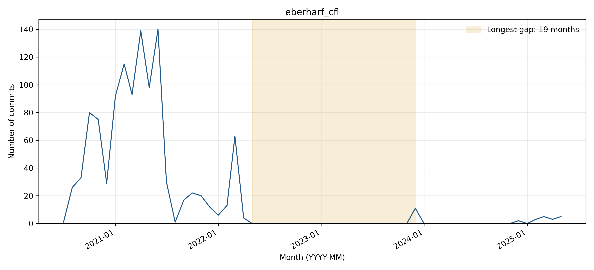

# eberharf_cfl: activity and longest-gap reflection

## Observed activity

The analyzed WoC records contain **1,138 commits** and **14 distinct author strings**, from 2020-07-17 through 2025-05-07. The longest observed inactivity gap is **2022-05 through 2023-11 (19 months)**, followed by **29 retrieved commits**. There are **2 gaps of at least three months**. Counts cover the first through last observed WoC month, without adding trailing inactivity. See `WOC_DATA_EXCEPTIONS.md` for the TA-approved use of retrieved data and the 54 documented unavailable objects across three projects.

**Activity pattern: declining.** Activity rises to large monthly bursts in early 2021, then falls sharply. The December 2023 restart and scattered 2024-2025 commits remain far below that initial intensity, so the overall trajectory is declining. There are two gaps of at least three months.

## Interpreting the gap

**Before themes:** Documentation updates:Bug fixes. **After themes:** Documentation updates:Dependency updates. Each sample uses the final ten commits before or the first ten after the boundary, or all if fewer. Labels follow the full messages, one primary topic per commit; ties are alphabetical. Generic test/configuration/refactoring messages are Other unless the message identifies a more specific topic.

**Hypothesis:** A lull after release and documentation work is plausible: the pre-gap sample includes a version bump, testing changes, and tutorial/API documentation. April 2022 issues list further features and maintenance, but neither those issues nor the sampled messages explains why commits stopped; the specific cause is unknown.

**Recovery:** Yes (29 observed commits after the gap). The first December 2023 commit adds a ridge-regression conditional-density-estimation option (09f7f4b2fc), followed by dependency, documentation, and version updates. The evidence supports a feature-led restart with maintenance work, not a proven external cause.

**Contributors:** All ten immediate post-gap commits use Iman Wahle, who also authored all ten pre-gap sampled commits. The restart is driven by an existing author identity. Names/emails are Git author metadata; raw author-string counts are not deduplicated person counts.

The monthly counts locate any zero-month interval in the analyzed records, but commit messages show what changed, not necessarily why work stopped. The boundary-window search returned ten issues, all opened April 2, 2022. Issues #24 and #25 propose density-estimation extensions; #29 requests broader platform testing, and #30 discusses clustering behavior for new data. They document a development roadmap, not proof that these requests caused the pause or were addressed by the restart. No README.md commits were returned within the window. The activity gap is clear, but its cause is harder to interpret without an explicit maintainer statement.

Supporting checks: [issues/PRs created in the boundary window](https://api.github.com/search/issues?q=repo%3Aeberharf%2Fcfl+created%3A2022-04-01..2023-12-31&per_page=30) and [README history or inspected change](https://api.github.com/repos/eberharf/cfl/commits?path=README.md&since=2022-04-01T00%3A00%3A00Z&until=2023-12-31T23%3A59%3A59Z&per_page=30). The search uses creation dates and does not exhaust later comments on older issues.

## Status at September 30, 2026

The latest GitHub default-branch commit on or before the cutoff is **2026-05-05T21:52:43Z**, so status is **Active** using April 1, 2026 as the Active threshold. See [recent-theme review](bdowlin2_recent_themes.md) for the separately reviewed latest commits. Recovery from an earlier gap does not imply current activity.

## Boundary commit evidence

### Before the gap

- [4b03a8e91f](https://github.com/eberharf/cfl/commit/4b03a8e91f61a4c3acb57a1493da2d3f7c7734a5) (2022-03-30): Inc hotfix version
- [419ca2af34](https://github.com/eberharf/cfl/commit/419ca2af346e288ecd96e6956d18ef3ed6732c8b) (2022-03-31): Change python testing reqs
- [838d3cc6ad](https://github.com/eberharf/cfl/commit/838d3cc6ad157bbdadf32ac7085d0391f942c483) (2022-03-31): Clean up readme
- [a522c44335](https://github.com/eberharf/cfl/commit/a522c443357a4cb2cafda7c4251f9541ba500bfd) (2022-03-31): Test python 3.7, 3.8
- [c46d99ccfe](https://github.com/eberharf/cfl/commit/c46d99ccfe96cfe529d0b0df93b33cefff288d6f) (2022-03-31): Fix hyperlink
- [33b9b91cac](https://github.com/eberharf/cfl/commit/33b9b91caca78b867f5c2cebe36994067535dcf1) (2022-03-31): Reorganize docs toctree
- [0c3eb28e77](https://github.com/eberharf/cfl/commit/0c3eb28e77dd2e5e316a530fc6eb6e2612eceb3c) (2022-04-01): Organize docs directory structure
- [79aa7eeab6](https://github.com/eberharf/cfl/commit/79aa7eeab64f8685cc426991d0c03a41aa1fd786) (2022-04-02): Update tutorials to match new cfl interface
- [03403403b8](https://github.com/eberharf/cfl/commit/03403403b85684e245ea62d2fa6ade7ea7c096e8) (2022-04-02): Fix title in notebook
- [d0e8b75880](https://github.com/eberharf/cfl/commit/d0e8b75880297b71f1ba7be45ad2c43d76464f03) (2022-04-02): Change test to val in cde plot
### After the gap

- [09f7f4b2fc](https://github.com/eberharf/cfl/commit/09f7f4b2fc12f8afb3b71023580839ebdc89e0cd) (2023-12-03): Add ridge reg CDE option
- [3f6e19b0ca](https://github.com/eberharf/cfl/commit/3f6e19b0cacbe1113ef208569fb721a8f956cc5a) (2023-12-03): Merge branch 'ridge' into dev
- [28dcac162e](https://github.com/eberharf/cfl/commit/28dcac162e25acb30b64f360244fc85c0bb34d8a) (2023-12-03): Set auto conda env update to false github actions
- [3566276a72](https://github.com/eberharf/cfl/commit/3566276a726254c0e985940b6676629d55d86ec3) (2023-12-03): Update dependencies
- [7d455a932b](https://github.com/eberharf/cfl/commit/7d455a932bb8f8453e389d8ebefd5e2e2d62c92e) (2023-12-03): Add readthedocs config
- [a577227ed8](https://github.com/eberharf/cfl/commit/a577227ed8bc6a93cc5ddc2a13ccfcdaef503a49) (2023-12-03): Update version
- [0b32b4d80a](https://github.com/eberharf/cfl/commit/0b32b4d80a5367499fb555bba2b13ee680b9f888) (2023-12-03): Add docs theme req
- [4d31afed6b](https://github.com/eberharf/cfl/commit/4d31afed6b7ed5b8546fee9967eadde4879aa838) (2023-12-03): Add class documentation
- [3bbcadd093](https://github.com/eberharf/cfl/commit/3bbcadd093c458bf6a885bbb814b17e0cfd08503) (2023-12-03): Update auto-docs
- [e8d587ed4e](https://github.com/eberharf/cfl/commit/e8d587ed4e3c7a3e008927595710185b06d29eb2) (2023-12-03): Format tuning figure
