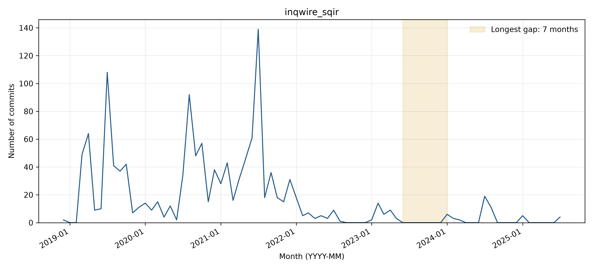

# inqwire_sqir: activity and longest-gap reflection

## Observed activity

The analyzed WoC records contain **1,338 commits** and **34 distinct author strings**, from 2018-12-20 through 2025-07-30. The longest observed inactivity gap is **2023-06 through 2023-12 (7 months)**, followed by **50 retrieved commits**. There are **5 gaps of at least three months**. Counts cover the first through last observed WoC month, without adding trailing inactivity. See `WOC_DATA_EXCEPTIONS.md` for the TA-approved use of retrieved data and the 54 documented unavailable objects across three projects.

**Activity pattern: declining.** Large development bursts in 2019-2021 give way to much lower activity from 2022 onward. Small 2024-2025 bursts do not return to the earlier intensity, supporting a declining overall trajectory. Five gaps last at least three months.

## Interpreting the gap

**Before themes:** Other:Dependency updates. **After themes:** Dependency updates:Documentation updates. Each sample uses the final ten commits before or the first ten after the boundary, or all if fewer. Labels follow the full messages, one primary topic per commit; ties are alphabetical. Generic test/configuration/refactoring messages are Other unless the message identifies a more specific topic.

**Hypothesis:** A dependency-maintenance hiatus is plausible: pre-gap work includes Coq compatibility, build restructuring, and CI. PR #54 was opened before the gap and merged after it, but neither it nor the messages states why commits stopped. The precise cause remains unknown.

**Recovery:** Yes (50 observed commits after the gap). The restart fixes the README installation URL, updates build/CI compatibility, and upgrades VOQC for Coq 8.18. PR #54, opened May 10, 2023, merged February 3, 2024; README corrections correspond to issue #55. These provide concrete maintenance tasks around the restart, not proof of an external trigger.

**Contributors:** Existing contributors drive the restart: eight of the ten sampled commits are by Adrian Lehmann and one by Robert Rand. The newly observed timotheeMM identity contributes one README-fix commit. Adrian uses differing email strings already present in pre-gap history; aliases alone do not establish a new person. Names/emails are Git author metadata; raw author-string counts are not deduplicated person counts.

The monthly counts locate any zero-month interval in the analyzed records, but commit messages show what changed, not necessarily why work stopped. PR #54 spans the gap: it was opened May 10, 2023 and merged February 3, 2024. Issue #55, opened November 16, 2023, reports installation-link problems that are addressed by post-gap documentation commits. These are stronger clues to the purpose of resumed work than a generic inactivity explanation. A direct check of commit d632f9e0c1 confirms the README URL repair, even though the path-filtered README history query returned no rows for the window. See https://github.com/inQWIRE/SQIR/pull/54 and https://github.com/inQWIRE/SQIR/issues/55.

Supporting checks: [issues/PRs created in the boundary window](https://api.github.com/search/issues?q=repo%3AinQWIRE%2FSQIR+created%3A2023-05-01..2024-01-31&per_page=30) and [README history or inspected change](https://github.com/inQWIRE/SQIR/commit/d632f9e0c11a5f3843904211ccf0fba041ef7130). The search uses creation dates and does not exhaust later comments on older issues.

## Status at September 30, 2026

The latest GitHub default-branch commit on or before the cutoff is **2025-07-30T02:27:23Z**, so status is **Inactive** using April 1, 2026 as the Active threshold. See [recent-theme review](bdowlin2_recent_themes.md) for the separately reviewed latest commits. Recovery from an earlier gap does not imply current activity.

## Boundary commit evidence

### Before the gap

- [cc3f4f06a1](https://github.com/inQWIRE/SQIR/commit/cc3f4f06a113bb82fe50ed29e3de2a7ca475f7c3) (2023-04-08): various updates to build system & directions for extraction
- [b1a3ef452c](https://github.com/inQWIRE/SQIR/commit/b1a3ef452c95f13a9a3f79fb26064a21df1570ab) (2023-04-08): Merge branch 'main' into update-build
- [a4963db6d2](https://github.com/inQWIRE/SQIR/commit/a4963db6d23318e9931b02853a8dc0faa94bf2bd) (2023-04-14): 8.17 compatibility for sqir
- [c620fa7051](https://github.com/inQWIRE/SQIR/commit/c620fa705151c1c9d27b0ecea0a2afe7b2e960a8) (2023-04-16): voqc compiling on 8.17
- [b35c50a9ed](https://github.com/inQWIRE/SQIR/commit/b35c50a9ed90379831b3602da041ddb68e63dea8) (2023-04-16): version bumps + dune changes
- [1f2db24aef](https://github.com/inQWIRE/SQIR/commit/1f2db24aefbc18b1545332238e89b1b143fa318a) (2023-04-16): version bump
- [320f694647](https://github.com/inQWIRE/SQIR/commit/320f6946470e6ed67b679d7155ecb17ea66fc163) (2023-04-17): Merge pull request #51 from inQWIRE/update-build
- [dc7e0d7df9](https://github.com/inQWIRE/SQIR/commit/dc7e0d7df952e182c118488f8b92333bdeb6c952) (2023-05-10): Merge pull request #53 from inQWIRE/main
- [e24080530a](https://github.com/inQWIRE/SQIR/commit/e24080530a4ee5ad43305de45913595f4914c99a) (2023-05-10): Remove SQIR as theory of VOQC
- [a76b448bf2](https://github.com/inQWIRE/SQIR/commit/a76b448bf2d922ec9f495ca3f599534d0437cda5) (2023-05-10): Merge pull request #50 from inQWIRE/add-ci
### After the gap

- [d632f9e0c1](https://github.com/inQWIRE/SQIR/commit/d632f9e0c11a5f3843904211ccf0fba041ef7130) (2024-01-26): Fix readme pin git url
- [3e4b8228ed](https://github.com/inQWIRE/SQIR/commit/3e4b8228ed7a5ef09e3c2d65af454a0e7e39bb8d) (2024-01-29): Merge branch 'main' into v8.17
- [aa72b66a76](https://github.com/inQWIRE/SQIR/commit/aa72b66a7631e4cbc8dfca96409c7f19b5db4a53) (2024-01-29): Update build files to 1.3.0
- [2403893ed2](https://github.com/inQWIRE/SQIR/commit/2403893ed2416276dbc49b269bde83ce42e37741) (2024-01-29): Merge remote-tracking branch 'origin/main' into v8.17
- [d7c4abd089](https://github.com/inQWIRE/SQIR/commit/d7c4abd089e817f78665d938fb853d2daf3daf33) (2024-01-30): Update CI to 8.16-8.18
- [2e0a6123b9](https://github.com/inQWIRE/SQIR/commit/2e0a6123b97f1fb410ca722826af60e0be7f08e8) (2024-01-30): Upgrade VOQC to work with 8.18
- [d31084e972](https://github.com/inQWIRE/SQIR/commit/d31084e9726f8b300f3e6972746b95cf2a5bd120) (2024-02-02): #55: Fix broken link and typo in README
- [d17539e96c](https://github.com/inQWIRE/SQIR/commit/d17539e96cb519fbbc728e85d6d684d6121d0611) (2024-02-02): Merge pull request #56 from timotheeMM/patch-1
- [af3aae99c9](https://github.com/inQWIRE/SQIR/commit/af3aae99c9dfd1f268947b2299d86c53b1041a37) (2024-02-03): Merge pull request #54 from inQWIRE/v8.17
- [a406cd74fa](https://github.com/inQWIRE/SQIR/commit/a406cd74fadfbe6083f63b2a8afa0fd37c0fd153) (2024-03-26): Emergency patch: Disallow building voqc with qlib 1.4.0 as it causes infinite loop
