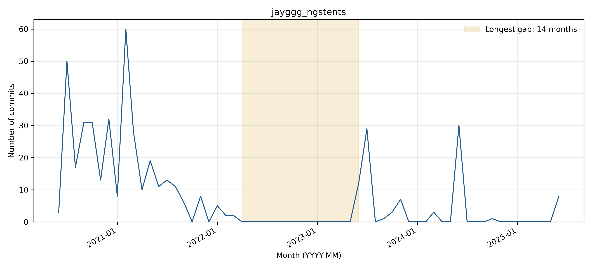

# jayggg_ngstents: activity and longest-gap reflection

## Observed activity

The complete WoC project manifest contains **454 commits** and **11 distinct author strings**, from 2020-06-29 through 2025-06-10. The longest inactivity gap is **2022-04 through 2023-05 (14 months)**. There are **4 gaps of at least three months** and **94 commits after the longest gap**. Counts cover the first through last observed WoC month, without adding trailing inactivity.

**Activity pattern: declining.** The strongest activity occurs in 2020 and early 2021, followed by lower activity and long pauses. Later bursts in 2023 and 2024 are smaller and isolated, so declining is a reasonable overall classification. Four zero-month runs last at least three months.

## Interpreting the gap

**Before themes:** Bug fixes:Dependency updates. **After themes:** Other:Bug fixes. Each sample uses the final ten commits before or the first ten after the boundary, or all if fewer. Labels follow the full messages, one primary topic per commit; ties are alphabetical. Generic test/configuration/refactoring messages are Other unless the message identifies a more specific topic.

**Hypothesis:** A maintenance lull after compatibility repairs is plausible: the last pre-gap messages fix TraverseDimensions and merge those fixes. No explicit cause is documented; the evidence does not establish abandonment, funding loss, or maintainer departure.

**Recovery:** Yes (94 observed commits after the gap). Jay resumed code cleanup, changed the default scheme because of a potential boundary-condition issue, removed nonworking code, and revised testing/usage documentation. This supports a maintenance and correctness-driven restart (4c4345d89d; 49ac4d31aa), without proving why June 2023 was chosen.

**Contributors:** All ten immediate post-gap commits use Jay Gopalakrishnan, an author already present before the gap. The observed restart was driven by an existing contributor rather than a newly observed author. Names/emails are Git author metadata; raw author-string counts are not deduplicated person counts.

The zero-month interval is straightforward to identify from complete data, but the causal interpretation is harder: commit messages show what changed, not necessarily why work stopped. The issue/PR search covering March 2022-June 2023 returned zero results, so it supplies no direct account of the pause. The June 28 README diff adds an examples section and reframes the tests as checks for new changes; it corroborates maintenance work but does not announce a formal revival. Observed recovery after the longest gap and Inactive status at the later cutoff are different findings.

Supporting checks: [issues/PRs created in the boundary window](https://api.github.com/search/issues?q=repo%3Ajayggg%2Fngstents+created%3A2022-03-01..2023-06-30&per_page=30) and [README history or inspected change](https://github.com/jayggg/ngstents/commit/49ac4d31aab0bba97b629498348bde056dcffa86). The search uses creation dates and does not exhaust later comments on older issues.

## Status at September 30, 2026

The latest GitHub default-branch commit on or before the cutoff is **2025-11-27T00:17:25Z**, so status is **Inactive** using April 1, 2026 as the Active threshold. See [recent-theme review](bdowlin2_recent_themes.md) for the separately reviewed latest commits. Recovery from an earlier gap does not imply current activity.

## Boundary commit evidence

### Before the gap

- [e90f9770f1](https://github.com/jayggg/ngstents/commit/e90f9770f15a40a08e1b6670991b1cdcd5821cbb) (2021-11-14): remove trefftz submodule
- [f457cdce08](https://github.com/jayggg/ngstents/commit/f457cdce08da595500b3433cc7e70f67d388516b) (2022-01-22): Merge pull request #26 from PaulSt/rmtrefftz
- [76eb285242](https://github.com/jayggg/ngstents/commit/76eb28524211e82c94d0a5ca615764fe1ad5e677) (2022-01-26): update workflow
- [1caa72c507](https://github.com/jayggg/ngstents/commit/1caa72c5073df20afe6a4b34ddd812f9cbc0e65a) (2022-01-26): fix simd to double error
- [2cf9da4055](https://github.com/jayggg/ngstents/commit/2cf9da40559dcebc5376113491e90d22e053cd07) (2022-01-26): fix simd lvalue error
- [71184ca266](https://github.com/jayggg/ngstents/commit/71184ca26613de6bc1c93071d8cb08dced8e2243) (2022-01-26): Merge pull request #27 from PaulSt/workflows
- [e52305f20f](https://github.com/jayggg/ngstents/commit/e52305f20f2ac8cdfc66e46a4c4b9e1947065e6e) (2022-02-08): hotfix traversedim
- [46851bdea4](https://github.com/jayggg/ngstents/commit/46851bdea42e6225a0deb420106dc843cd06b6f5) (2022-02-08): replace TraverseDimensions function
- [4a6c2b66e2](https://github.com/jayggg/ngstents/commit/4a6c2b66e2f8e7506f061a4e2fa0e407ec17e12f) (2022-03-19): Merge pull request #28 from PaulSt/traversedim
- [7b899f3db4](https://github.com/jayggg/ngstents/commit/7b899f3db42a5b3bfce0cd90655135575366df97) (2022-03-19): merge two traversedim fixes
### After the gap

- [e60cc2aae9](https://github.com/jayggg/ngstents/commit/e60cc2aae98721287d62a1995459f0c66132d478) (2023-06-26): minor
- [a77f54f2e2](https://github.com/jayggg/ngstents/commit/a77f54f2e23b6ef1256fb6aa7b3123add38af80d) (2023-06-27): moving a 1d drawtents utility & removing unchecked code
- [5ec5e8fb64](https://github.com/jayggg/ngstents/commit/5ec5e8fb64e64aa7a414be0766c3f7c8eddbcfac) (2023-06-27): removing unused
- [dc5408fdf3](https://github.com/jayggg/ngstents/commit/dc5408fdf3495404de79b66ee03b9f6c5f2d4347) (2023-06-27): clean up simple 1d plt draw
- [4c4345d89d](https://github.com/jayggg/ngstents/commit/4c4345d89d22bf9b733473477fdd5e99d777ea4c) (2023-06-27): change default to SARK due to potential bc issue with SAT
- [4cb9182868](https://github.com/jayggg/ngstents/commit/4cb91828683cccaac636c951745d7e416dcb8fa6) (2023-06-27): ensuring that tests passs
- [2a71e396f4](https://github.com/jayggg/ngstents/commit/2a71e396f4e1c1acdfa3473f22dc65af92a1ed3d) (2023-06-27): removing nonworking code
- [a0efa613db](https://github.com/jayggg/ngstents/commit/a0efa613db858ae90222cac08239116a3e2b3398) (2023-06-27): reflects recent revisions
- [49ac4d31aa](https://github.com/jayggg/ngstents/commit/49ac4d31aab0bba97b629498348bde056dcffa86) (2023-06-28): reflects recent revisions
- [52d74885a3](https://github.com/jayggg/ngstents/commit/52d74885a32f1e7ea67d5ab20f80ced5fe4cbd40) (2023-06-29): const cannot have return value
