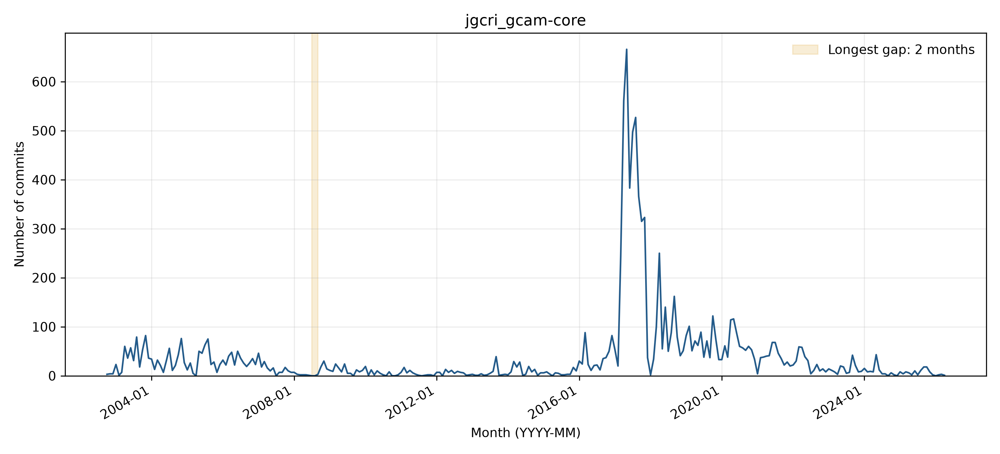

# jgcri_gcam-core: activity and longest-gap reflection

## Observed activity

The analyzed WoC records contain **10,677 commits** and **161 distinct author strings**, from 2002-10-14 through 2026-04-01. The longest observed inactivity gap is **2008-07 through 2008-08 (2 months)**, followed by **8874 retrieved commits**. There are **0 gaps of at least three months**. Counts cover the first through last observed WoC month, without adding trailing inactivity. See `WOC_DATA_EXCEPTIONS.md` for the TA-approved use of retrieved data and the 54 documented unavailable objects across three projects.

**Activity pattern: irregular.** The timeline has distinct phases, including an exceptional 2017 burst followed by lower activity and a gradual decline after 2020. This large isolated change and the differing earlier phases make irregular a better overall label than a single steady trend. The longest observed zero-month run is July-August 2008, and there are no gaps of at least three months.

## Interpreting the gap

**Before themes:** Feature development:Bug fixes. **After themes:** Other:Bug fixes. Each sample uses the final ten commits before or the first ten after the boundary, or all if fewer. Labels follow the full messages, one primary topic per commit; ties are alphabetical. Generic test/configuration/refactoring messages are Other unless the message identifies a more specific topic.

**Hypothesis:** A short pause during data-processing and model-maintenance work is plausible. Pre-gap messages concern XML/database tools, CSV conversion, and model fixes; post-gap work continues similar tasks. No message or supporting discussion gives a direct reason for the two-month pause, so a workload or funding explanation would be speculative.

**Recovery:** Yes (8,874 retrieved commits after the observed gap). Pralit Patel resumes CSV-converter functionality on September 4, 2008, followed by parser and data-reading fixes. October messages move directories, copy a branch described as the new main development line, and adjust model/project configuration. These identify the resumed work without establishing the timing or cause of the pause.

**Contributors:** The post-gap sample contains seven commits by existing contributor Pralit Patel and three by the newly observed Page Kyle author string. Page Kyle does not appear in the full retrieved pre-gap history, but a newly observed string is not proof that a new person joined at that time. Pralit drives most sampled resumed work. Names/emails are Git author metadata; raw author-string counts are not deduplicated person counts.

The monthly counts locate any zero-month interval in the analyzed records, but commit messages show what changed, not necessarily why work stopped. The June-September 2008 issue/PR and README-history searches returned no results, limiting supplementary historical evidence. The post-gap messages directly show resumed converter and parser work; the October branch-copy message provides context for integration but occurs after the first restart. The sparse early messages and absence of explanatory discussion make the cause difficult to interpret. Eleven unavailable manifest objects are omitted under the approved reduced-data approach, so all historical metrics are qualified as observations from the retrieved records.

Supporting checks: [issues/PRs created in the boundary window](https://api.github.com/search/issues?q=repo%3AJGCRI%2Fgcam-core+created%3A2008-06-01..2008-09-30&per_page=30) and [README history or inspected change](https://api.github.com/repos/JGCRI/gcam-core/commits?path=README.md&since=2008-06-01T00%3A00%3A00Z&until=2008-09-30T23%3A59%3A59Z&per_page=30). The search uses creation dates and does not exhaust later comments on older issues.

## Status at September 30, 2026

The latest GitHub default-branch commit on or before the cutoff is **2026-06-01T21:04:27Z**, so status is **Active** using April 1, 2026 as the Active threshold. See [recent-theme review](bdowlin2_recent_themes.md) for the separately reviewed latest commits. Recovery from an earlier gap does not imply current activity.

## Boundary commit evidence

### Before the gap

- [c934ae658e](https://github.com/JGCRI/gcam-core/commit/c934ae658e65f4ab87f6100a356ecf33c1fa2769) (2008-02-12): Fixed an issue that was causing a crash when writing to the access db.  The Ag production change vector had values beyond the model end period so now only values until the model end period will be written.
- [2eae3db158](https://github.com/JGCRI/gcam-core/commit/2eae3db15854a5178f3c671cac90d12537db1001) (2008-02-20): Fixes to land-use history/land-area retrieval and forest calibration. Reviewed Pralit.
- [9f13cda6a7](https://github.com/JGCRI/gcam-core/commit/9f13cda6a797466b1be962b01ded039e0ae05d78) (2008-02-22): Changed the way polygon shape files are read in so that the res used is just the working res and the dataValue for a polygon is weighted by the portion of the area the box takes of the polygon
- [7b26102282](https://github.com/JGCRI/gcam-core/commit/7b261022824d95cfdfa06459649e92e85a048100) (2008-03-04): Numberous changes which include making the XMLDB a singleton so as to be used by any module that needs it.  Also moved it under the xmldb package.  A small fix for the csv conversions.  Added the emissions downscaler to the dm.  Added support to run things via a batch file.  Currently only csv files are supported but queries, the pp and dm are soon to come.
- [bad83dee8f](https://github.com/JGCRI/gcam-core/commit/bad83dee8f7ce3efcd4a03c9cc7235333228dbc6) (2008-03-04): Minor fixes to various things.
- [7ba24f6e87](https://github.com/JGCRI/gcam-core/commit/7ba24f6e876acebb9b23b50680584004d63b251e) (2008-04-11): Made it so if multiple single query values from the same the same parent they get combined into one query on copy
- [dd1f22f3cc](https://github.com/JGCRI/gcam-core/commit/dd1f22f3ccbc0c77cb74d34207384a8a9b7ffa38) (2008-04-16): Fixed a bug in csv conversions where the grand parent should merge its attrs with an already existing node.  Also takes care of the extra blank nodes left behind from similar situations.
- [ca1f4a6b3f](https://github.com/JGCRI/gcam-core/commit/ca1f4a6b3fd2550fef195e3276bbf50a5d1b481f) (2008-05-13): Import/export multiple runs from xmldb
- [156740b28c](https://github.com/JGCRI/gcam-core/commit/156740b28c5467e9fe1aa6b2f3de0ed087b23696) (2008-05-22): Split runs into different sheets for batch queries
- [331129f8c8](https://github.com/JGCRI/gcam-core/commit/331129f8c8221fd532a4cb7f920e5e4cc29a76a8) (2008-06-04): Ability to write mutliple years to a netcdf if trying to output a grouped by year variable.  Also a fix in sceintific data read in, which now a allows a + after the E.
### After the gap

- [51bccf9f0a](https://github.com/JGCRI/gcam-core/commit/51bccf9f0a115685f40019bd62fe393e39a3e5a8) (2008-09-04): Added the ability for the csv converter to read a header/table that has node name renames and applies that to the current tree at the time of reading.  This is useful when have nested structures which should use the same node name
- [b16d54b168](https://github.com/JGCRI/gcam-core/commit/b16d54b168f0225c2e7e72c328baff282b0a0a71) (2008-09-12): Added parseLessThanOrEqual command plus a fix to csv outputting.
- [64b0d3d268](https://github.com/JGCRI/gcam-core/commit/64b0d3d2681f3f48049e18c51de966ce88504db6) (2008-09-12): Fix for overwriting data in the MatrixRepository.  Fix a bug when reading a seed file.  Add the ability to skip lines when reading a txt input.  Update reading NetCDF Region Def files.  TODO: clean up debugging code.
- [a730ac1b72](https://github.com/JGCRI/gcam-core/commit/a730ac1b724c7ccbfe668cb0169f51d66a957a2c) (2008-10-07): 
- [4a48a79ac3](https://github.com/JGCRI/gcam-core/commit/4a48a79ac3ee0a6db12b3a1d455f517c6e09feeb) (2008-10-07): Moving the exe directory to the correct spot
- [b71b92e338](https://github.com/JGCRI/gcam-core/commit/b71b92e338181dc9ae68ea91f9ef50352a48d5b9) (2008-10-07): Moving the input directory to the correct spot
- [d07c9cfce4](https://github.com/JGCRI/gcam-core/commit/d07c9cfce4f298da43c7bbb4db6c7ea15ba42a6b) (2008-10-07): reset electricity subsector shareweight scaleyear to 2005
- [8f91c84363](https://github.com/JGCRI/gcam-core/commit/8f91c843632824f3d0bb0039f4912f78e1002754) (2008-10-07): Copy the mult-inputs branch in the workspace.  This should now be the main line for development
- [8009dd8ca5](https://github.com/JGCRI/gcam-core/commit/8009dd8ca505eb17f6cc6e44e3607f6510f85e1f) (2008-10-14): Added batch_csv_outputter to the project file. R: KVC
- [a8daed9df0](https://github.com/JGCRI/gcam-core/commit/a8daed9df0db9bc21141f003b3f1f1507e592aea) (2008-10-22): gpk: removes warning message for coefs of 0. R: Pralit
