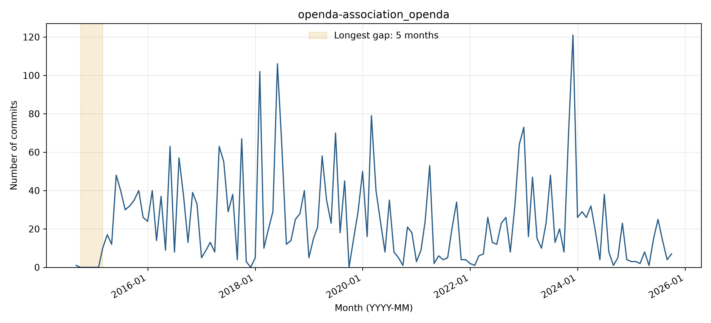

# openda-association_openda: activity and longest-gap reflection

## Observed activity

The analyzed WoC records contain **3,202 commits** and **63 distinct author strings**, from 2014-09-24 through 2025-10-22. The longest observed inactivity gap is **2014-10 through 2015-02 (5 months)**, followed by **3201 retrieved commits**. There are **1 gaps of at least three months**. Counts cover the first through last observed WoC month, without adding trailing inactivity. See `WOC_DATA_EXCEPTIONS.md` for the TA-approved use of retrieved data and the 54 documented unavailable objects across three projects.

**Activity pattern: irregular.** Monthly counts fluctuate sharply, with bursts in 2018 and late 2023 and quieter intervening periods, without a clear fixed seasonal cycle. The available-record timeline has one gap of at least three months: October 2014-February 2015. This early gap follows a single repository-setup commit, making it different from a mature project stopping development.

## Interpreting the gap

**Before themes:** Other. **After themes:** Other:Bug fixes. Each sample uses the final ten commits before or the first ten after the boundary, or all if fewer. Labels follow the full messages, one primary topic per commit; ties are alphabetical. Generic test/configuration/refactoring messages are Other unless the message identifies a more specific topic.

**Hypothesis:** Repository initialization followed by a later source-code migration is the strongest explanation: the only pre-gap commit adds root directories, and the first post-gap message explicitly says the OpenDA open-source code was moved into this repository. This supports a delay in populating the repository rather than proof that OpenDA development itself stopped.

**Recovery:** Yes (3,201 retrieved commits after the observed gap). The March 20, 2015 commit 8bef65262f explicitly moves the OpenDA code into the repository. Subsequent messages integrate build components, fix project configuration and executable permissions, and migrate wrapper changes, supporting repository population and integration as the observed restart.

**Contributors:** The pre-gap sample contains only Adri Mourits. The ten post-gap commits use four newly observed author strings: Edwin Bos, Arno Kockx, Nils van Velzen, and Marc-Etienne Ridler. Because pre-gap history contains only one setup commit, these new strings do not establish that new people replaced an earlier development team. Names/emails are Git author metadata; raw author-string counts are not deduplicated person counts.

The monthly counts locate any zero-month interval in the analyzed records, but commit messages show what changed, not necessarily why work stopped. The boundary-window issue/PR and README-history searches returned zero results. The commit messages supply direct migration evidence: the first post-gap commit says the code was moved into the repository, and another explicitly mentions migrating working-copy changes. Only one pre-gap message exists, so Other is the sole defensible pre-gap theme. Seven manifest-listed WoC objects are unavailable; under the approved reduced-data approach these reported gaps, author counts, and samples describe the retrieved records, not a certified complete manifest.

Supporting checks: [issues/PRs created in the boundary window](https://api.github.com/search/issues?q=repo%3AOpenDA-Association%2FOpenDA+created%3A2014-09-01..2015-03-31&per_page=30) and [README history or inspected change](https://api.github.com/repos/OpenDA-Association/OpenDA/commits?path=README.md&since=2014-09-01T00%3A00%3A00Z&until=2015-03-31T23%3A59%3A59Z&per_page=30). The search uses creation dates and does not exhaust later comments on older issues.

## Status at September 30, 2026

The latest GitHub default-branch commit on or before the cutoff is **2026-07-10T13:57:20Z**, so status is **Active** using April 1, 2026 as the Active threshold. See [recent-theme review](bdowlin2_recent_themes.md) for the separately reviewed latest commits. Recovery from an earlier gap does not imply current activity.

## Boundary commit evidence

### Before the gap

- [8409136d3c](https://github.com/OpenDA-Association/OpenDA/commit/8409136d3c2eef36e957f21ddd8869655876fbb2) (2014-09-24): openda: Adding root directories
### After the gap

- [8bef65262f](https://github.com/OpenDA-Association/OpenDA/commit/8bef65262f578a4689afa2a47bd1d78eca0a9481) (2015-03-20): Moved the OpenDA Open Source code to this repository.
- [e702379b8e](https://github.com/OpenDA-Association/OpenDA/commit/e702379b8e5176231bb553e028859c11435b92e3) (2015-03-24): Added core castor and observers castor to the main build script.
- [37ddcd3552](https://github.com/OpenDA-Association/OpenDA/commit/37ddcd3552098c6f70d35b1e168a9d1390adfba8) (2015-03-24): Corrected openda.ipr file.
- [2baf5751e8](https://github.com/OpenDA-Association/OpenDA/commit/2baf5751e89f71fb6126ddec66a55223268503c6) (2015-03-24): ODA-327: Moved method getFilePathStringForPython to BBUtils.
- [e5675125f0](https://github.com/OpenDA-Association/OpenDA/commit/e5675125f0db422fe7dfe06f2bf34d0a3ef72dbf) (2015-03-26): set/fix executable bits for configure and install-sh sripts of native
- [1dd5295942](https://github.com/OpenDA-Association/OpenDA/commit/1dd529594267f0d32421cba7da092a0257a77458) (2015-03-27): ODA-279
- [083e6515de](https://github.com/OpenDA-Association/OpenDA/commit/083e6515de0609a98ac903df6c4ce9bfa1228a55) (2015-03-27): 
- [8694afd394](https://github.com/OpenDA-Association/OpenDA/commit/8694afd394e72180d16ff11b54365773e2a7cea3) (2015-03-27): For random number generation
- [6bda8535ca](https://github.com/OpenDA-Association/OpenDA/commit/6bda8535cafecbf23b688e5fff51c27fac112d3e) (2015-03-27): Returns the number of observations
- [f290d8bf75](https://github.com/OpenDA-Association/OpenDA/commit/f290d8bf75475eb0864477136a333f7fbf818446) (2015-03-27): Now works for the SZ.
