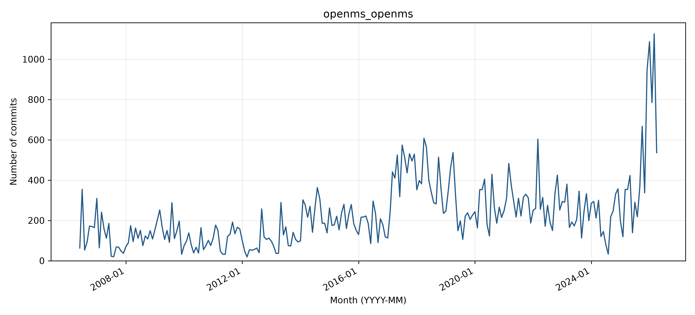

# openms_openms: activity and longest-gap reflection

## Observed activity

The analyzed WoC records contain **54,828 commits** and **538 distinct author strings**, from 2006-06-11 through 2026-04-17. There is **no observed zero-month inactivity gap**, so gap dates, recovery counts, and boundary samples are not applicable. There are **0 gaps of at least three months**. Counts cover the first through last observed WoC month, without adding trailing inactivity. See `WOC_DATA_EXCEPTIONS.md` for the TA-approved use of retrieved data and the 54 documented unavailable objects across three projects.

**Activity pattern: rising.** Every month in the observed June 2006-April 2026 range has at least one retrieved commit. Monthly activity is typically higher after 2013 than in the early years, with especially large late-2025/2026 bursts, supporting a rising overall trajectory despite substantial fluctuations. There are no zero-month gaps and no gaps of at least three months in this observed range.

## Interpreting the gap

**Before themes:** N/A: no gap. **After themes:** N/A: no gap. Each sample uses the final ten commits before or the first ten after the boundary, or all if fewer. Labels follow the full messages, one primary topic per commit; ties are alphabetical. Generic test/configuration/refactoring messages are Other unless the message identifies a more specific topic.

**Hypothesis:** N/A active Project

**Recovery:** N/A: no observed inactivity gap.. N/A: no observed inactivity gap.

**Contributors:** N/A: no recovery boundary exists. Names/emails are Git author metadata; raw author-string counts are not deduplicated person counts.

The monthly counts locate any zero-month interval in the analyzed records, but commit messages show what changed, not necessarily why work stopped. No longest-gap boundary exists, so selecting before/after themes or inventing a recovery cause would be misleading. The separate recent-theme review provides linked GitHub commit evidence for current work. The observed nonzero counts establish continuous monthly activity within the retrieved date range; the unavailable records could affect totals and date extrema, so the report does not claim exact full-manifest coverage. The rising label describes the broad chart trajectory, not a monotonic increase each month.

Project context: [GitHub repository](https://github.com/OpenMS/OpenMS). No gap-window search is applicable because no zero-month interval exists in the analyzed range.

## Status at September 30, 2026

The latest GitHub default-branch commit on or before the cutoff is **2026-09-30T17:00:08Z**, so status is **Active** using April 1, 2026 as the Active threshold. See [recent-theme review](bdowlin2_recent_themes.md) for the separately reviewed latest commits. Recovery from an earlier gap does not imply current activity.

## Boundary commit evidence

### Before the gap

### After the gap

