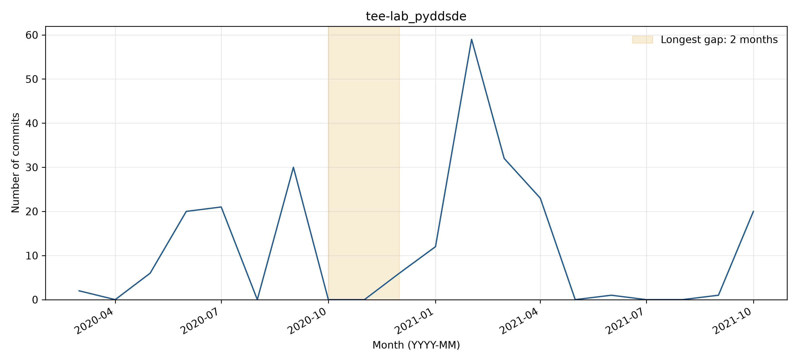

# tee-lab_pyddsde: activity and longest-gap reflection

## Observed activity

The analyzed WoC records contain **233 commits** and **7 distinct author strings**, from 2020-03-30 through 2021-10-29. The longest observed inactivity gap is **2020-10 through 2020-11 (2 months)**, followed by **154 retrieved commits**. There are **0 gaps of at least three months**. Counts cover the first through last observed WoC month, without adding trailing inactivity. See `WOC_DATA_EXCEPTIONS.md` for the TA-approved use of retrieved data and the 54 documented unavailable objects across three projects.

**Activity pattern: irregular.** Activity is irregular, with 30 commits in September 2020, a two-month pause, and a larger burst of 59 commits in February 2021. There are zero inactivity gaps of at least three months. The isolated peaks do not establish a recurring seasonal cycle.

## Interpreting the gap

**Before themes:** Other:Documentation updates. **After themes:** Other:Feature development. Each sample uses the final ten commits before or the first ten after the boundary, or all if fewer. Labels follow the full messages, one primary topic per commit; ties are alphabetical. Generic test/configuration/refactoring messages are Other unless the message identifies a more specific topic.

**Hypothesis:** A short development pause is plausible: the final September commits concern notebooks and refactoring, followed by numerical-method additions in December. No message states why work paused; workload or funding explanations are unsupported.

**Recovery:** Yes (154 observed commits after the gap). Work resumed with the nfft method and autocorrelation-timescale calculation (2c096d6cfb), followed by refactoring and plotting changes. This supports renewed method development as the observed purpose, not a confirmed external trigger.

**Contributors:** The first ten post-gap commits use the same ashwinkk23 author identity already present before the gap; no new author identity appears in that sample. Names/emails are Git author metadata; raw author-string counts are not deduplicated person counts.

The monthly counts locate any zero-month interval in the analyzed records, but commit messages show what changed, not necessarily why work stopped. The assigned GitHub URL redirects to tee-lab/PyDaddy. A search of issues and pull requests created from September through December 2020 returned zero results; this does not prove no discussion existed elsewhere. The September 25 README change adds installation and usage information and does not announce abandonment. The WoC project history ends in October 2021, while current GitHub history extends into 2026, so the WoC endpoint must not be used to infer present inactivity.

Supporting checks: [issues/PRs created in the boundary window](https://api.github.com/search/issues?q=repo%3Atee-lab%2FPyDaddy+created%3A2020-09-01..2020-12-31&per_page=30) and [README history or inspected change](https://github.com/tee-lab/PyDaddy/commit/578b3accae09e75742702cee4939d8d2db8a46d1). The search uses creation dates and does not exhaust later comments on older issues.

## Status at September 30, 2026

The latest GitHub default-branch commit on or before the cutoff is **2026-06-10T04:11:37Z**, so status is **Active** using April 1, 2026 as the Active threshold. See [recent-theme review](bdowlin2_recent_themes.md) for the separately reviewed latest commits. Recovery from an earlier gap does not imply current activity.

## Boundary commit evidence

### Before the gap

- [e83a4395d7](https://github.com/tee-lab/PyDaddy/commit/e83a4395d7a6464fe52f57d2258977ce2b043d7e) (2020-09-25): added test code
- [590581685e](https://github.com/tee-lab/PyDaddy/commit/590581685e4497de69904b61d4bccd17b2a3e132) (2020-09-25): updated .gitignore
- [a5c6819363](https://github.com/tee-lab/PyDaddy/commit/a5c6819363edcfed63ce98c20d488ab64532c4d6) (2020-09-25): Updated readme
- [26fb4b6088](https://github.com/tee-lab/PyDaddy/commit/26fb4b6088356e1306446435b8e1e17a13509651) (2020-09-25): updated .gitignore
- [19251e74ad](https://github.com/tee-lab/PyDaddy/commit/19251e74add5c68824a60189c85cf6d5a55ed021) (2020-09-25): updated .gitignore
- [578b3accae](https://github.com/tee-lab/PyDaddy/commit/578b3accae09e75742702cee4939d8d2db8a46d1) (2020-09-25): Update README.md
- [5adb2dda23](https://github.com/tee-lab/PyDaddy/commit/5adb2dda235fb851de2bd708c077c3f0accdb48f) (2020-09-25): linguist - make ipynb files vendored
- [ea96e55fba](https://github.com/tee-lab/PyDaddy/commit/ea96e55fba80b384ff1a63185f9a9cef3fb7dea5) (2020-09-27): refactored methods
- [850950ef4f](https://github.com/tee-lab/PyDaddy/commit/850950ef4fbcf7d96dcc75f3285f0562d2110c5b) (2020-09-27): Modifies notebook files
- [cf1e4d8cab](https://github.com/tee-lab/PyDaddy/commit/cf1e4d8cab9aa50875db7f31a670658ddc483097) (2020-09-27): Updated notebook files
### After the gap

- [2c096d6cfb](https://github.com/tee-lab/PyDaddy/commit/2c096d6cfbbea663d307be7579ff15030c0e93b8) (2020-12-22): Added nfft method
- [966c2f9143](https://github.com/tee-lab/PyDaddy/commit/966c2f9143b871e4027b8f8aa3c1eefd74ea6afa) (2020-12-23): optimized
- [0d82142f1d](https://github.com/tee-lab/PyDaddy/commit/0d82142f1d29fe966c259a5844f7c4ff9e2b1cf8) (2020-12-23): Refactored mehtods
- [90454a5258](https://github.com/tee-lab/PyDaddy/commit/90454a5258850bfc99168df6f0b59bc1dca5c911) (2020-12-23): Refactored methods
- [c7a7ce5d9f](https://github.com/tee-lab/PyDaddy/commit/c7a7ce5d9f56478bef83389a6f5dfb4a73a20b72) (2020-12-23): Merge branch 'master' of https://github.com/tee-lab/pyFish
- [9ece5a30d5](https://github.com/tee-lab/PyDaddy/commit/9ece5a30d59e6531d2ce91f8b49930c842b30d21) (2020-12-23): Changed plot axis lables
- [1591816b81](https://github.com/tee-lab/PyDaddy/commit/1591816b8132eae53e4c3b14a2501665fa8fe3ba) (2021-01-03): fixed 3d hist plot
- [683df5d57a](https://github.com/tee-lab/PyDaddy/commit/683df5d57acd4ebcdbf8aa6f8ae17b3685c88cb8) (2021-01-03): Merge remote-tracking branch 'origin/master' into optimium_timescale
- [5cd0fce4eb](https://github.com/tee-lab/PyDaddy/commit/5cd0fce4eb6f46a14c7ac707d53ebcf191e2c4f4) (2021-01-03): added synthetic data
- [48e8ba0c8b](https://github.com/tee-lab/PyDaddy/commit/48e8ba0c8bb0d8bb8ac3d0612a02c8ee412e0ecd) (2021-01-08): removed some data files
