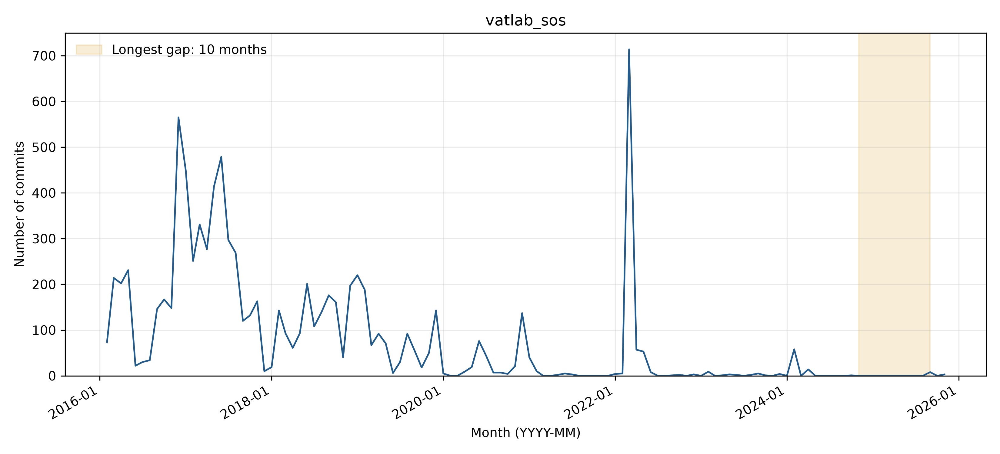

# vatlab_sos: activity and longest-gap reflection

## Observed activity

The analyzed WoC records contain **8,834 commits** and **55 distinct author strings**, from 2016-02-13 through 2025-11-06. The longest observed inactivity gap is **2024-11 through 2025-08 (10 months)**, followed by **11 retrieved commits**. There are **3 gaps of at least three months**. Counts cover the first through last observed WoC month, without adding trailing inactivity. See `WOC_DATA_EXCEPTIONS.md` for the TA-approved use of retrieved data and the 54 documented unavailable objects across three projects.

**Activity pattern: declining.** Typical monthly activity falls substantially after the large 2016-2019 development period. A very large isolated spike in 2022 interrupts this decline, but later activity remains sparse and does not establish a sustained return to the earlier level. Three gaps last at least three months; the longest spans November 2024-August 2025.

## Interpreting the gap

**Before themes:** Dependency updates:Bug fixes. **After themes:** Dependency updates:Bug fixes. Each sample uses the final ten commits before or the first ten after the boundary, or all if fewer. Labels follow the full messages, one primary topic per commit; ties are alphabetical. Generic test/configuration/refactoring messages are Other unless the message identifies a more specific topic.

**Hypothesis:** A maintenance lull is plausible after Python compatibility repairs, a release, and deprecation-related work. No sampled message explains why commits stopped for ten months, so a maintainer departure, funding problem, or abandonment cannot be established.

**Recovery:** Yes (11 observed commits after the gap; limited resumption). Work resumes with migration to pyproject.toml and hatchling, uv environment support, contribution documentation, and Invoke task automation. Issue #1547, opened September 6, 2025, reports a pkg_resources deprecation warning; PR #1548, opened September 9, documents the packaging and tooling cleanup. These support concrete maintenance needs around the restart, without proving the issue caused the restart.

**Contributors:** All ten sampled post-gap commits use existing Bo Peng or Bo author strings already present before the gap. Several messages disclose Claude Code assistance, but a human author remains recorded; AI co-authorship alone is not evidence of unattended bot contributions or a new maintainer. Names/emails are Git author metadata; raw author-string counts are not deduplicated person counts.

The monthly counts locate any zero-month interval in the analyzed records, but commit messages show what changed, not necessarily why work stopped. Issue #1547 reports a concrete deprecation warning shortly before the September 2025 restart; PR #1548 explicitly lists modern packaging, Invoke, and uv work. The path-filtered README query returned no rows, but direct inspection of documentation commit 88f592df3f confirms revised installation, build, and contribution instructions. The longest gap is easy to locate; its cause is harder to establish because these sources describe maintenance requirements rather than a decision to suspend work. The post-gap sample also includes a merge repeating earlier component changes, so ten messages do not represent ten independent new initiatives.

Supporting checks: [issues/PRs created in the boundary window](https://api.github.com/search/issues?q=repo%3Avatlab%2Fsos+created%3A2024-10-01..2025-09-30&per_page=30) and [README history or inspected change](https://github.com/vatlab/sos/commit/88f592df3f1700458cf98f01608bf5016374cc42). The search uses creation dates and does not exhaust later comments on older issues.

## Status at September 30, 2026

The latest GitHub default-branch commit on or before the cutoff is **2026-09-09T18:36:17Z**, so status is **Active** using April 1, 2026 as the Active threshold. See [recent-theme review](bdowlin2_recent_themes.md) for the separately reviewed latest commits. Recovery from an earlier gap does not imply current activity.

## Boundary commit evidence

### Before the gap

- [7b50195676](https://github.com/vatlab/sos/commit/7b501956767d0012c785ef0df033a336eb6f0612) (2024-04-10): Python 3.11 and below compatibility
- [070ab49ab4](https://github.com/vatlab/sos/commit/070ab49ab423ee934beaa7f9cadb5a07d9e4f60c) (2024-04-10): Try to fix task related tests for python 3.9
- [1720da9c21](https://github.com/vatlab/sos/commit/1720da9c2120c8ab3ccfe2da8f1079a8278d4698) (2024-04-10): Fix option -s for command sos execute
- [fa5c550d1f](https://github.com/vatlab/sos/commit/fa5c550d1f2591d040a884cc9d20bf8399507e49) (2024-04-10): Fix for python 3.12
- [7b6a822b6a](https://github.com/vatlab/sos/commit/7b6a822b6a943a55dfe85199c08e7fb6488d590f) (2024-04-10): Use the same version of python for test docker container
- [a511fa9199](https://github.com/vatlab/sos/commit/a511fa91993c3d9b54571d7751aa548d80e50e8d) (2024-04-10): Issue1542 (#1543)
- [a08c6d4243](https://github.com/vatlab/sos/commit/a08c6d424362dc6ddb0a3996d4ef21fd8fbc7839) (2024-04-11): release sos 0.25.1
- [9afcdc79a9](https://github.com/vatlab/sos/commit/9afcdc79a9f1596e7c7f393b55dbc752d43c691e) (2024-04-11): Update README.md
- [6a9d0379d6](https://github.com/vatlab/sos/commit/6a9d0379d67f5703408af04e39d998334e0b345a) (2024-04-11): Update README.md (#1545)
- [7c3aa02e8a](https://github.com/vatlab/sos/commit/7c3aa02e8a7257706766fe1e576e014dc627d90c) (2024-10-17): Deprecating pkg_resources
### After the gap

- [8caabf4242](https://github.com/vatlab/sos/commit/8caabf424296c89f7dfc46d0732028ae82176b79) (2025-09-09): Migrate from setup.py to pyproject.toml
- [50d6a3f43d](https://github.com/vatlab/sos/commit/50d6a3f43d0edfa2d30b6fb5dbb5be32e1d288f8) (2025-09-09): Update pyproject.toml to use hatchling build backend
- [88f592df3f](https://github.com/vatlab/sos/commit/88f592df3f1700458cf98f01608bf5016374cc42) (2025-09-09): Add comprehensive build and contribution documentation
- [f1b907998d](https://github.com/vatlab/sos/commit/f1b907998d91e9d1356df086a9911a9af115bfd7) (2025-09-09): Add uv support for virtual environment management
- [20b4073a49](https://github.com/vatlab/sos/commit/20b4073a49098e56b7cf0de0162db4b4550e20fe) (2025-09-09): Add Invoke task automation system
- [88b4fb412f](https://github.com/vatlab/sos/commit/88b4fb412f53fb80099adb195f0cb688e21e7e92) (2025-09-09): Fix: Replace os.chdir with c.cd in Invoke tasks
- [357ea55a03](https://github.com/vatlab/sos/commit/357ea55a0301f4c45207114c44202f8a02d9ecfb) (2025-09-09): run lint format
- [8a155be4b1](https://github.com/vatlab/sos/commit/8a155be4b1c6ed437a7f60fbe012774854cb59f8) (2025-09-09): fix linting errors
- [b2fa21fbed](https://github.com/vatlab/sos/commit/b2fa21fbedfdeda2f37fc3a8e314aa4089685e41) (2025-11-05): Cleanup (#1548)
- [67b9e6ce22](https://github.com/vatlab/sos/commit/67b9e6ce22e0245dcd1a6e4a5873ff822b00097b) (2025-11-05): improve type annotation
