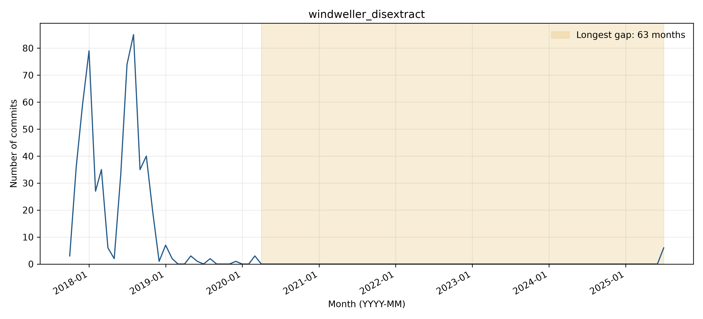

# windweller_disextract: activity and longest-gap reflection

## Observed activity

The complete WoC project manifest contains **559 commits** and **9 distinct author strings**, from 2017-10-29 through 2025-07-13. The longest inactivity gap is **2020-04 through 2025-06 (63 months)**. There are **2 gaps of at least three months** and **6 commits after the longest gap**. Counts cover the first through last observed WoC month, without adding trailing inactivity.

**Activity pattern: declining.** Activity is concentrated in 2017-2018, dwindles to occasional documentation changes, and then stops for 63 months. The six WoC commits on a single July 2025 day represent only a brief return, not a sustained rising trajectory. Two gaps last at least three months.

## Interpreting the gap

**Before themes:** Documentation updates:Other. **After themes:** Other. Each sample uses the final ten commits before or the first ten after the boundary, or all if fewer. Labels follow the full messages, one primary topic per commit; ties are alphabetical. Generic test/configuration/refactoring messages are Other unless the message identifies a more specific topic.

**Hypothesis:** The README identifies the code as a research-paper training repository, largely written in 2017 with old dependencies and without a cleaned-up release. Combined with documentation-only pre-gap activity, this supports a research-artifact maintenance lull as a hypothesis, not a verified reason for the 2020 stop.

**Recovery:** Yes (brief resumption only; six commits on one day). The July 2025 activity consists of uploads and bookcorpus.py changes. The uploaded README repeats the older research context, making republication or restoration plausible. Messages do not establish a renewed research program or sustained maintenance.

**Contributors:** Post-gap commits use testtt7272 and windweller with the same email, different from the pre-gap Allen Nie identity. These are newly observed author strings, not proof of different people or a confirmed ownership transfer. Names/emails are Git author metadata; raw author-string counts are not deduplicated person counts.

The zero-month interval is straightforward to identify from complete data, but the causal interpretation is harder: commit messages show what changed, not necessarily why work stopped. The current GitHub default branch has only three commits, while WoC associates 559 commits with the project. The first current-branch upload introduces the README from an empty file, consistent with a history-scope change; this is insufficient to prove the exact mechanism of deletion, rewriting, or recreation. The search across March 2020-July 2025 returned zero issues/PRs. The README contains no dated explanation of the gap. Only Other is defensible for the generic post-gap messages; a second topic is not fabricated.

Supporting checks: [issues/PRs created in the boundary window](https://api.github.com/search/issues?q=repo%3Awindweller%2FDisExtract+created%3A2020-03-01..2025-07-31&per_page=30) and [README history or inspected change](https://github.com/windweller/DisExtract/commit/5d71a5ab4f3f175044185c35811e7a9789b379bc). The search uses creation dates and does not exhaust later comments on older issues.

## Status at September 30, 2026

The latest GitHub default-branch commit on or before the cutoff is **2025-07-13T15:34:42Z**, so status is **Inactive** using April 1, 2026 as the Active threshold. See [recent-theme review](bdowlin2_recent_themes.md) for the separately reviewed latest commits. Recovery from an earlier gap does not imply current activity.

## Boundary commit evidence

### Before the gap

- [0d4be2e3e0](https://github.com/windweller/DisExtract/commit/0d4be2e3e012197f49ae489c25775f1ccd63fb07) (2019-05-17): Update README.md
- [8233688d09](https://github.com/windweller/DisExtract/commit/8233688d0935d9288de323e4adabbb4a3e75ccaf) (2019-05-31): Update README.md
- [629853945b](https://github.com/windweller/DisExtract/commit/629853945b9298d822327e21b7e0a72747d6ede2) (2019-05-31): Update README.md
- [673c5c2213](https://github.com/windweller/DisExtract/commit/673c5c2213db099c70aff170c343db12dfb81e63) (2019-06-03): Create LICENSE
- [d2207cf099](https://github.com/windweller/DisExtract/commit/d2207cf0996307cac87cf2043ddc5cdcb3588ef8) (2019-08-07): Update README.md
- [25344ccc84](https://github.com/windweller/DisExtract/commit/25344ccc845477c8f89add3f36911035a9f2ef35) (2019-08-13): Update README.md
- [526d9c750c](https://github.com/windweller/DisExtract/commit/526d9c750cfe7de866244a8ab43cd35b026a675d) (2019-12-24): Update README.md
- [ee11db9e2a](https://github.com/windweller/DisExtract/commit/ee11db9e2a7f3b20a3fdbe6bfc3642074b7f63fb) (2020-03-07): Update README.md
- [3d5e9bbc67](https://github.com/windweller/DisExtract/commit/3d5e9bbc67fdf4d77fe053780964f707ab7c4200) (2020-03-26): Update README.md
- [edacf44bd3](https://github.com/windweller/DisExtract/commit/edacf44bd31bbdf85c8bc57c4b64257ce2f65661) (2020-03-26): Update README.md
### After the gap

- [5d71a5ab4f](https://github.com/windweller/DisExtract/commit/5d71a5ab4f3f175044185c35811e7a9789b379bc) (2025-07-13): Add files via upload
- [4c3984ea3c](https://github.com/windweller/DisExtract/commit/4c3984ea3c0326d38d54f9ef8aa2292e2b2ad9ee) (2025-07-13): Add files via upload
- [acee584fac](https://github.com/windweller/DisExtract/commit/acee584fac9fd411f00d9534c56435cf176a50af) (2025-07-13): Update bookcorpus.py
- [5f316e00eb](https://github.com/windweller/DisExtract/commit/5f316e00ebf1cffbd42b8e0af1cb653d030983d4) (2025-07-13): Update bookcorpus.py
- [d06b29318a](https://github.com/windweller/DisExtract/commit/d06b29318aab45e920295d2803cc7aadc922e5d8) (2025-07-13): Update bookcorpus.py
- [ba3bb9365b](https://github.com/windweller/DisExtract/commit/ba3bb9365b96d583f4ed02220e234f987276c5b8) (2025-07-13): Add files via upload
